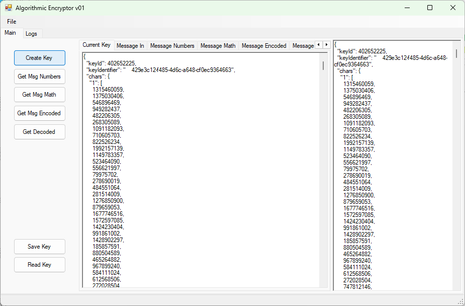
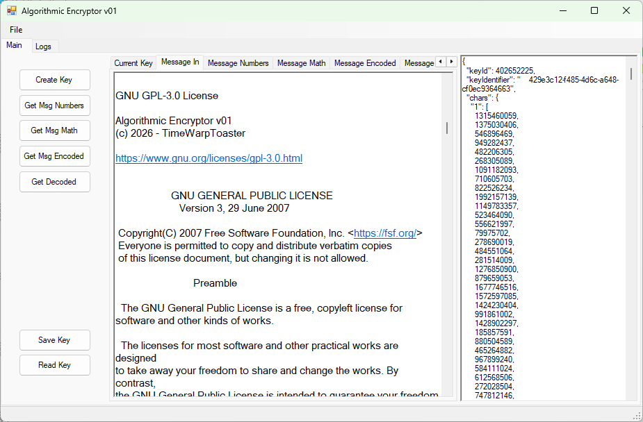
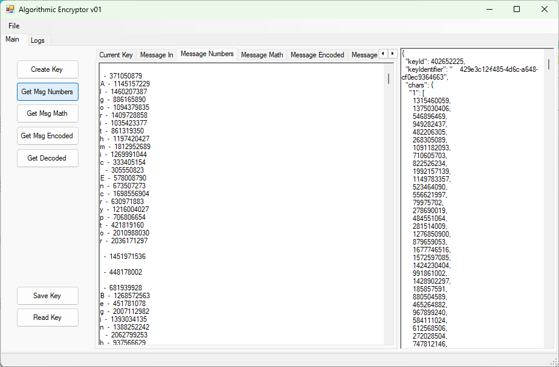
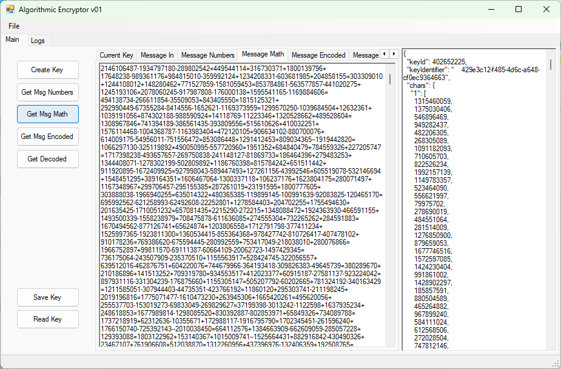
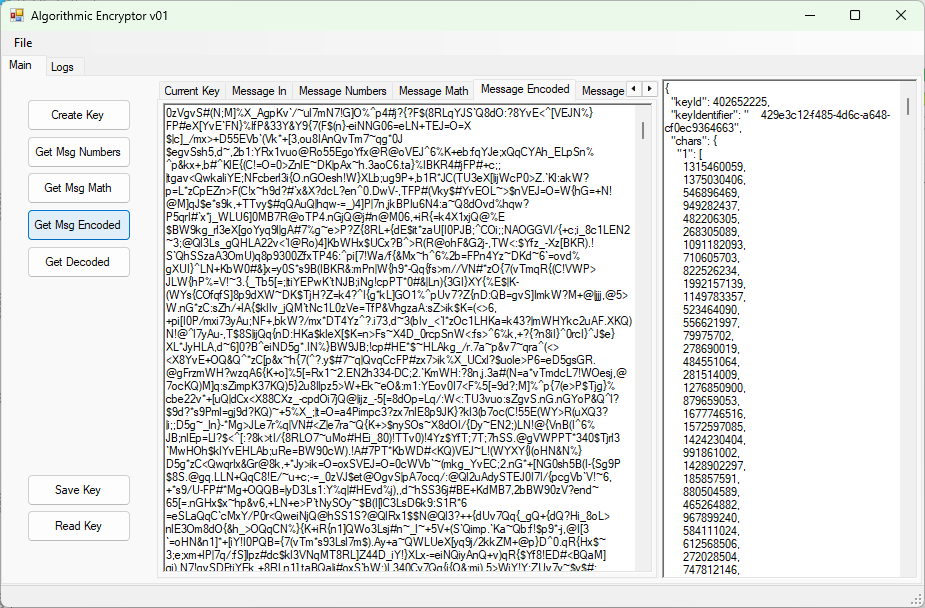
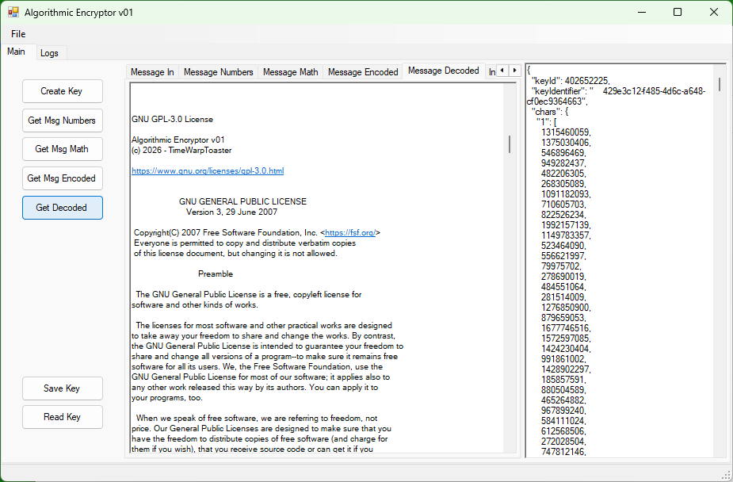

# Algorithmic Encryptor
Basic proof-of-concept type app, to prove viability of encoding text to equations, then obfuscating the more evenly distributed digits and operators. 

# How-To Use - 2026-08-13

Begin by creating a key, from the button on left. You may choose to save this key for use again later. Once a key has been created or read (if existing), the Current Key tab will show the key, in json format, as will the far right slide-out "compare" region. The compare region, is for if you wish to reverse the logic of other tabs.

On the Message In tab, type a message you wish to encrypt. This harness app, as it is built, can handle messages upto a few pages long. Because of the expansion of volume, and the hastiness of the this harness app, there is a finite breaking point beyond a couple thousand words of input message.

Switch to the Message Numbers tab, and click on the "Get Msg Numbers" button. Listed in the view, are each character individually, and the number chosen from its assigned values, to represent it in this encoding of the message. Each character has a chance of being represented, by many different values.

Open the Message Math tab, and click on the "Get Msg Math" button. The numbers selected to represent your characters, have been turned into quasi-random equations, that solve back to the number.

From the Message Encoded tab, click the "Get Msg Encoded" button. Each character from the Message Math tab output, has been converted into a three character piece of text. Each math character has been represented by one three-character string, from a pool of equivalent such strings.

Keys can be saved, using Save Key, and loaded using Read Key. A word of caution, there is not much safety-railing. You can reload keys and keep working, but the other tabs will not update their content, until their corresponding action has been called again. Further, if you change keys, and skip over Get Msg Numbers, and go straight to Get Msg Math, it will work with the old content from the Message Numbers tab. This is meant to be an experiment, not a finished product. Used as such, it works.

All of the text-fields are interactive. Meaning, you can make notes in keys. You can also mess up the math or encoding (which is functional text), or make meaningless changes to the numbers selected. More interestingly, you can paste a previously encoded message, from somewhere, and decrypt it, assuming you have the key-file.
 

### Current Key / Create Key

 

### Message In

 

### Message Numbers

 

### Numbers Math

 

### Math Encoded

 

### Message Decoded

 
 

## Flaws and Limitations

This app is not hiding much. If you feel you have had an error, or something did not behave properly, check the Logs tab at far top. Most errors are reported there. If decoding and you get a set of three symbols that are not found, it is a good sign that the incorrect key is loaded to decrypt with.

Everything runs on the UI thread. In general, your message size should be small enough, that this is of little or no impact. Maybe a few seconds on decode. If however, you are encoding chapters of your latest book, expect to wait and not click other buttons until it has finished.

The entire contents for all actions are posted to ui for review. The downside, is this further implies a limit to message size, as the full message, assigned numbers per character, equations, encoded format, and decoded will be loaded at-once.

Performance has not really been an issue. Much could be done to make things faster, but full encryption is always expensive. That said, this is suitable for encrypting text, or small files, but not much else. The encoded state, almost precludes advanced media.

As this is an experiment, keys created are stored in human-readable format for validation. That is, the keys are not secured.

The random equation generator, was built, and works, but even usage of operators is far-more complex than I wanted to entertain. For one thing, you cannot multiply half-of-the time, because the current value is larger than half-of-max. You can divide if the current value is greater than 2 or 3, but division has a propensity to drive the running value into single digits. There are ways to solve these (somewhat), but I have not done it. More plainly, this app and code, plays artificial favoritism for addition and subtraction when building random equations. This is exaggerated slightly, by forcing + or - as the final operation of an equation to arrive back at the final value. A more advanced algorithm could solve this. As could support for decimals.

This app was built in three-days. If you are serious about moving a message, prove your decrypt before sending.

Update to the above, I had to pull multiplication and division from the equation building, for reasons I just really did not have the time to attend to. Multiples would occasionally draw too far out of bounds, to self correct with a finishing subtraction of Int32.MaxValue or less. Division was getting a small rounding difference, by the end of equation, this could result in the number being off by a few-points. Maybe somebody else will have fun solving these.
